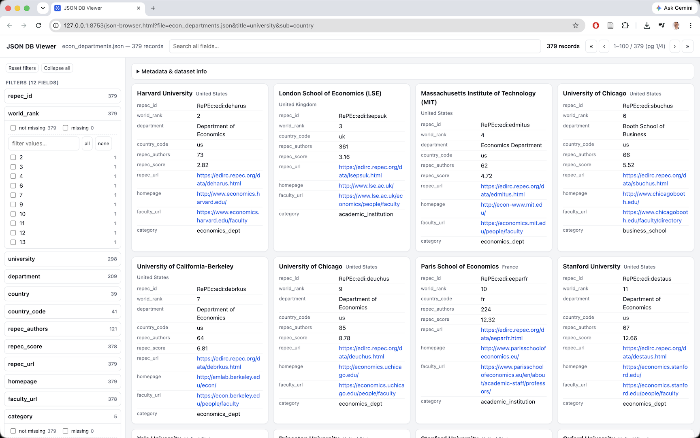

# JSON DB Viewer (`json-browser.html`)

A single-file, dependency-free web app for browsing, filtering, and sharing views
of **any** JSON dataset. Everything — markup, CSS, JS, and the favicon — lives in
one self-contained `json-browser.html`; there is no build step, no server-side
code, and no network calls except fetching the JSON file you point it at. Open it
locally or serve it statically; all logic runs in the browser.

It is fully generic: it inspects whatever JSON you load, discovers the record
array and the fields, and builds the filter UI automatically. Nothing is
hard-coded to a particular dataset.

---

## Quick start

The easiest way is the bundled **`serve-json.sh`** helper. It serves the viewer
together with any JSON file — located *anywhere* on disk — and opens it in your
browser:

```bash
cd json
./serve-json.sh path/to/data.json                   # default port 8753
./serve-json.sh path/to/data.json 9000              # custom port (a bare integer)
./serve-json.sh path/to/data.json q=harvard ps=all  # open with a preset view
```

It symlinks the viewer and your JSON into an isolated temp directory, starts
`python3 -m http.server` bound to `127.0.0.1`, opens the browser at the correct
`?file=` URL, and tears it all down on Ctrl-C. The JSON does not need to sit next
to the viewer.

Any extra arguments are appended to the page URL as query parameters, so you can
launch the viewer in a preset state — global search (`q=…`), paging (`ps=…`),
view mode (`view=full`), or filters (`f.<field>=<value>`, repeatable for OR). A
bare-integer argument is taken as the port. See [Shareable URLs](#shareable-urls)
for the full parameter list.

### Serving it yourself

If you'd rather run the server by hand, do it from the directory that contains
`json-browser.html`:

```bash
cd json
python3 -m http.server 8753 --bind 127.0.0.1
# then open:
#   http://127.0.0.1:8753/json-browser.html
#   http://127.0.0.1:8753/json-browser.html?file=path/to/data.json
```

A static server is needed for the `?file=` auto-load and the shareable links
because the viewer fetches data with `fetch()`, which browsers block for `file://`
URLs (CORS).

### Opening directly from disk (`file://`)

You can also open `json-browser.html` straight from disk — double-click it, or open
its `file://` URL — with no server at all. Since `fetch()` is blocked for `file://`,
the `?file=` parameter and shareable links won't work, but the **Load JSON…** button
and drag-and-drop do. This is the quickest way to glance at a local file.

---

## Loading data

Four ways, any of which works with any JSON file:

1. **URL parameter** — `?file=<path-or-URL>`. The path is resolved relative to the
   page (e.g. `?file=top5-approach/authors.json`) or can be an absolute URL the
   server/CORS allows. This is the only method that participates in shareable
   links (below).
2. **Load from URL** — the field in the left sidebar (under *Display*). Paste a
   URL (or relative path) and press **Load** or Enter; the app fetches it,
   displays it, and writes it into `?file=` so the view becomes a shareable link.
   The remote server must permit cross-origin (CORS) requests.
3. **Load JSON…** button — bottom of the left sidebar (under *Display*). Opens a
   native file picker.
4. **Drag and drop** — drop a `.json` file anywhere on the window.

With no `?file=` parameter the app starts on a **blank page** showing a
"No JSON loaded" prompt. There is no default dataset.

The page sends `Cache-Control: no-cache`, so a normal browser refresh always
re-loads the current `?file=` and re-reads the page itself (handy while a dataset
is being regenerated).

---

## What counts as a "record" and a "field"

**Record array.** On load the app scans the top level of the JSON:

- if the root is an **array**, its elements are the records (`(root array)`);
- if the root is an **object**, every top-level value that is an array is offered
  as a candidate record array (e.g. `authors`, `records`, `data`);
- if the root is an object with **no** array child, the object itself is shown as
  a single record;
- when several arrays exist, it auto-selects the first of
  `authors, records, data, items, rows, results`, else the first array found. You
  can change the choice with **Main record array** (Display options). Any
  top-level keys that are *not* the chosen record array are shown as dataset
  metadata.

**Scalar (one-to-one) vs nested fields.** A field is **scalar** if its value is
never an object or array in any record (strings, numbers, booleans, null). Scalar
fields are the ones that get filters and appear as key/value rows on cards.
A field whose value is an object or array in any record is **nested**; nested
fields are shown as collapsible expanders on each card, not as filters.

---

## Layout



- **Header:** title, current filename, a full-width **search** box, the live
  matched-record count, and pagination (`«` first, `‹` prev, page info, `›` next,
  `»` last). The pager is hidden when *Records per page* is `all`.
- **Left sidebar:** **Reset filters** / **Collapse all** actions, the **Filters**
  list (one collapsible panel per scalar field), and at the bottom the **Display**
  options and the **Load JSON…** button.
- **Main area:** a collapsed **Metadata & dataset info** panel (record count,
  field inventory, and any non-record top-level keys from the file), then the
  records as cards.

---

## Filtering

Each scalar field has a collapsible filter panel (the count next to its name is
how many distinct values are currently selectable). Open one to get:

- **not missing** / **missing** checkboxes with counts — keep records that have
  (or lack) a value for the field. "Missing" means `null`, `undefined`, or empty
  string.
- a checkbox per **value**, with the count of matching records. Fields with many
  values get a type-ahead box to filter the value list; the list is capped at
  1000 shown values (with a "refine the filter" note) for performance.
- **all** / **none** buttons to bulk toggle the visible values.

Within one field, selected values are **OR**-ed (and OR-ed with the
missing/present choices). Across different fields, constraints are **AND**-ed. A
field with an active filter is marked in the list; **Reset filters** clears
everything including the search.

### Honest (responsive) faceting

Filters are *responsive*: as soon as any filter or the search is active, every
**other** field's panel updates to show only the values — and counts — that are
still reachable given the current selection. Values that can no longer occur drop
out; a value you have already checked always stays visible (shown with count 0 if
it no longer co-occurs) so you can uncheck it.

The field you are actively filtering keeps showing all of *its* options (its own
selection is excluded from its own facet), so you can always broaden or change
that field. The "missing"/"not missing" counts are faceted the same way.
Concretely: filtering `field = applied` makes the `status` panel show
verified/student/… counts **within applied only**, while the `field` panel still
lists applied/macro/theory so you can switch.

### Global search

The header search box matches records whose **any** field contains the typed text
(case-insensitive substring; nested values are searched as their JSON text). It
combines (AND) with the field filters and also drives the facet counts.

---

## Display options (left sidebar)

| Option | Effect |
|--------|--------|
| **Records per page** | `100` / `500` / `1000` / `all`. `all` hides the pager. |
| **Main record array** | Which top-level array (or the root/whole object) to treat as the records. Changing it re-analyzes fields and resets filters. |
| **Card title field** | Which scalar field is the card heading. Defaults to the first of `name, title, display_name, label, id, uid`, else the first scalar field. |
| **Card subtitle field** | Optional smaller heading next to the title; `(none)` by default. |
| **View** | `cards` (responsive grid) or `full-width records` (one record per row, wider key/value layout). |

The title and subtitle fields are omitted from the card's key/value body to avoid
repetition.

---

## How records render

- **Cards** show the title (+ optional subtitle), then one `key: value` row per
  non-empty scalar field. **Empty fields are hidden** — a scalar field that is
  missing for a record simply doesn't appear on that card.
- **Nested fields** (arrays/objects) appear as collapsible `field (n)` expanders,
  rendered lazily when opened, and only when non-empty:
  - an **array of objects** renders each item compactly; if an item has a
    `title`/`name` it's shown with any of `journal, venue, source, year, date`
    appended (nice for publication lists), otherwise as `key: value; …`;
  - an **array of scalars** renders as chips;
  - an **object** renders as nested key/value rows.
- **Values** are formatted by type: booleans get a true/false pill, strings that
  start with `http(s)://` become clickable links (open in a new tab), `null`/empty
  shows as an em dash.

---

## Shareable URLs

Every change to a filter, the search, the record source, paging, or a display
option is written back into the address bar (via `history.replaceState`, so it
doesn't spam browser history). **Copy the URL at any moment and it reproduces the
exact view** — file, filters, search, page, and display settings. Opening such a
URL restores all of it after the data loads.

Query parameters (all optional except `file`; defaults are omitted to keep URLs
short):

| Parameter | Meaning |
|-----------|---------|
| `file` | Path or URL of the JSON to load |
| `rec` | Record-array key (only emitted when the file has more than one array) |
| `q` | Global search string |
| `ps` | Records per page (`100`/`500`/`1000`/`all`); omitted when `100` |
| `view` | `full` for full-width records (omitted for the default `cards`) |
| `title` | Card title field (when changed from the default) |
| `sub` | Card subtitle field; `__none__` means explicitly no subtitle |
| `page` | 1-based page number (when not on page 1) |
| `f.<field>=<value>` | A selected value for `<field>` (repeated for multiple values) |
| `p.<field>=1` | The "not missing" checkbox for `<field>` |
| `m.<field>=1` | The "missing" checkbox for `<field>` |

Field names are prefixed (`f.`/`p.`/`m.`) so they can never collide with the
reserved parameters. Example:

```
?file=top5-approach/authors.json&q=harvard&ps=all&m.phd_year=1&f.status=verified&f.status=student&f.research_field=applied
```

→ load `authors.json`, show all matches for the search "harvard" among
applied-field authors whose status is verified or student and whose `phd_year` is
missing.

---

## Self-contained & private

- One HTML file; no external scripts, fonts, or stylesheets; the favicon is an
  inline data URI.
- All processing is client-side. The only network request is the `fetch()` of the
  JSON file you choose; files you open via the picker or drag-and-drop never leave
  the browser.
- Works offline. Copy `json-browser.html` anywhere and open it.

---

## Notes & limits

- Designed for "browse and slice" use; comfortably handles datasets in the tens of
  thousands of records. Faceting is roughly `O(records × active filters)` per
  change, so very large datasets with many simultaneous filters will get slower.
- The per-field value list shows at most 1000 entries; narrow with the value
  type-ahead or other filters to reach the rest.
- A "scalar" field must be scalar in **every** record; if a field is sometimes an
  object/array it is treated as nested (no filter).
- For `file://` use, only the picker and drag-and-drop work (browsers block
  `fetch()` of local files); serve over HTTP to use `?file=` and shareable links.

---

## Files

- `json-browser.html` — the viewer (everything is inside it).
- `serve-json.sh` — helper that serves the viewer with a given JSON file and opens it.
- `example.sh` — sample invocation of `serve-json.sh` with a preset view.
- `readme.md` — this document.
