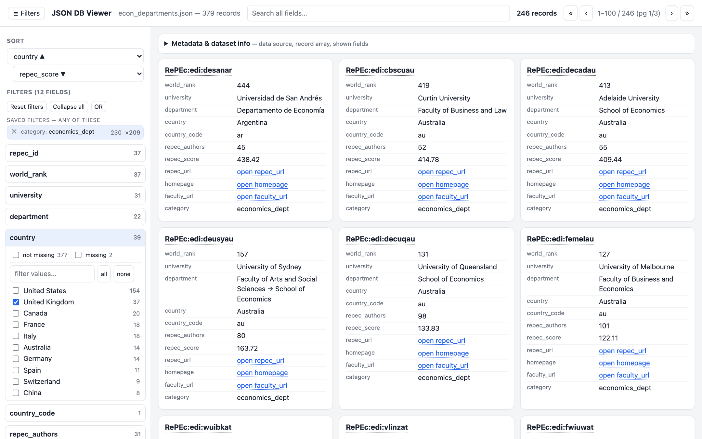

# JSON DB Viewer (`json-browser.html`)

A single-file, dependency-free web app for browsing, filtering, and sharing views
of **any** JSON dataset. Everything — markup, CSS, JS, and the favicon — lives in
one self-contained `json-browser.html`; there is no build step, no server-side
code, and no network calls except fetching the JSON file you point it at. Open it
locally or serve it statically; all logic runs in the browser.

It is fully generic: it inspects whatever JSON you load, discovers the record
array and the fields, and builds the filter UI automatically. Nothing is
hard-coded to a particular dataset.

---

## Quick start

The easiest way is the bundled **`serve-json.sh`** helper. It serves the viewer
together with any JSON file — located *anywhere* on disk — and opens it in your
browser:

```bash
cd json
./serve-json.sh path/to/data.json                   # default port 8753
./serve-json.sh path/to/data.json 9000              # custom port (a bare integer)
./serve-json.sh path/to/data.json q=harvard ps=all  # open with a preset view
```

It symlinks the viewer and your JSON into an isolated temp directory, starts
`python3 -m http.server` bound to `127.0.0.1`, opens the browser at the correct
`?file=` URL, and tears it all down on Ctrl-C. The JSON does not need to sit next
to the viewer.

Any extra arguments are appended to the page URL as query parameters, so you can
launch the viewer in a preset state — global search (`q=…`), paging (`ps=…`),
view mode (`view=full`), or filters (`f.<field>=<value>`, comma-separated for OR). A
bare-integer argument is taken as the port. See [Shareable URLs](#shareable-urls)
for the full parameter list.

### Serving it yourself

If you'd rather run the server by hand, do it from the directory that contains
`json-browser.html`:

```bash
cd json
python3 -m http.server 8753 --bind 127.0.0.1
# then open:
#   http://127.0.0.1:8753/json-browser.html
#   http://127.0.0.1:8753/json-browser.html?file=path/to/data.json
```

A static server is needed for the `?file=` auto-load and the shareable links
because the viewer fetches data with `fetch()`, which browsers block for `file://`
URLs (CORS).

### Opening directly from disk (`file://`)

You can also open `json-browser.html` straight from disk — double-click it, or open
its `file://` URL — with no server at all. Since `fetch()` is blocked for `file://`,
the `?file=` parameter and shareable links won't work, but the **Load file…**
button and drag-and-drop do. This is the quickest way to glance at a local file.

---

## Loading data

Four ways, any of which works with any JSON file:

1. **URL parameter** — `?file=<path-or-URL>`. The path is resolved relative to the
   page (e.g. `?file=top5-approach/authors.json`) or can be an absolute URL the
   server/CORS allows. This is the only method that participates in shareable
   links (below).
2. **Load from URL** — the field in the **Metadata & dataset info** panel at the
   top of the record area. Paste a URL (or relative path) and press the button or
   Enter; the app fetches it, displays it, and writes it into `?file=` so the view
   becomes a shareable link. The remote server must permit cross-origin (CORS)
   requests.
3. **Load file…** button — next to it, in the same panel. Opens a native file
   picker. (Both loaders also appear on the "No JSON loaded" start page.)
4. **Drag and drop** — drop a `.json` file anywhere on the window.

With no `?file=` parameter the app starts on a **blank page** showing a
"No JSON loaded" prompt. There is no default dataset.

The page sends `Cache-Control: no-cache`, so a normal browser refresh always
re-loads the current `?file=` and re-reads the page itself (handy while a dataset
is being regenerated).

---

## What counts as a "record" and a "field"

**Record array.** On load the app scans the top level of the JSON:

- if the root is an **array**, its elements are the records (`(root array)`);
- if the root is an **object**, every top-level value that is an array is offered
  as a candidate record array (e.g. `authors`, `records`, `data`);
- if the root is an object with **no** array child, the object itself is shown as
  a single record;
- when several arrays exist, it auto-selects the first of
  `authors, records, data, items, rows, results`, else the first array found. You
  can change the choice with **Main record array** in the **Metadata & dataset
  info** panel. Any
  top-level keys that are *not* the chosen record array are shown as dataset
  metadata.

**Scalar (one-to-one) vs nested fields.** A field is **scalar** if its value is
never an object or array in any record (strings, numbers, booleans, null). Scalar
fields are the ones that get filters and appear as key/value rows on cards.
A field whose value is an object or array in any record is **nested**; nested
fields are shown as collapsible expanders on each card, not as filters.

---

## Layout



- **Header:** the **☰** panel button, title, current filename, a full-width
  **search** box, the live matched-record count, and pagination (`«` first, `‹`
  prev, page info, `›` next, `»` last). The pager is hidden when *Records per page*
  is `all`.
- **Left sidebar:** three sections — **Sort** (one dropdown, plus
  [further ones](#breaking-ties-with-further-fields) while ties remain), **Filters** (its
  **Reset filters** / **Collapse all** / **[OR](#combining-sets-of-filters-with-or)**
  buttons, any saved filter sets, then one collapsible panel per scalar field), and
  **Display** options at the bottom.
- **Main area:** a collapsed **Metadata & dataset info** panel — the data source
  controls, the record-array choice, the field on/off switches, the record count,
  and any non-record top-level keys from the file — then the records as cards.
  Nested fields on a card open with a click, or on every card at once with a
  [double-click](#how-records-render).

### Small screens

The **☰** button in the header folds the whole left panel away, giving the records
the full width. Below 820px the layout stops squeezing the records into a column
beside a 310px panel and stacks instead: the panel becomes a scrollable band above
them, and starts folded, so a phone shows the data first and the controls on
demand. Widening the window past the breakpoint brings the panel back; a click on
☰ overrides that until the next crossing.

The state is deliberately **not** in the URL — a shared link shouldn't carry the
screen width of whoever made it.

---

## Sorting

The **Sort** dropdown at the top of the sidebar orders the records by any one field
that is switched on. Every field is listed **twice** — `world_rank ▲` sorts
ascending, `world_rank ▼` descending — so either direction is one choice away.
`(file order)`, the default, leaves the records as they appear in the file.

### Breaking ties with further fields

Sorting on a field with repeated values leaves the order half-decided. Whenever
that happens a **second dropdown appears**, stepped in below the first, and then a
third — each one ordering only the records the levels above left tied:

```
SORT
  country ▲
    category ▲
      world_rank ▼
```

The extra box is offered only while ties actually remain, so a field with unique
values (an id, say) ends the cascade immediately, and it stops at **three levels**
regardless — past that the ordering is doing more than a reader can follow.

Each level has its own direction, and its own `(last word)` variants where they
apply. Setting a level to `(none)` drops it and everything below it. A level whose
field is later switched off is skipped and the ones under it move up, matching how
a filter on a switched-off field is suspended.

Every level travels in the URL as one short parameter whose name carries the
direction — `sa=country&sd=category` is *country ascending, then category
descending* — read back in the order they appear, so no numbering is needed.

Values sort by what they are, not by how they print: numbers — and strings that are
numbers — compare numerically, so `9` comes before `10`; text compares
case-insensitively with embedded digits still ordered numerically (`item2` before
`item10`); booleans put `false` first. Records that tie keep their file order.

Records **missing** the field sort last in **both** directions — reversing the data
shouldn't dredge the empty rows to the top.

### Sorting people by surname

A field called exactly **`name`** (any capitalization, stray spaces tolerated — but
not `full_name` or `surname`) gets **two extra options**, `name (last word) ▲` and
`name (last word) ▼`, which order by the **last word** of the value. On a list of
people that is the surname:

| by whole name | by last word |
|---|---|
| Ada Lovelace, Alan Turing, Ann Smith, Grace Hopper, John Smith, John von Neumann, Madonna | Grace **Hopper**, Ada **Lovelace**, **Madonna**, John von **Neumann**, Ann **Smith**, John **Smith**, Alan **Turing** |

A one-word name sorts on itself, and a multi-part surname sorts on its last word
(`von Neumann` under N). Values with the same last word fall back to the whole
name, so the Smiths land together *and* in order. The mode is part of the URL
(`last=1`); on any other field the flag is ignored rather than obeyed.

To recognize a differently-named column, widen the one-line `NAME_FIELD` regex near
the top of the script.

The whole result is sorted, not just the page you are looking at, and the
underlying data is never reordered — going back to `(file order)` restores it
exactly. Sorting is independent of filtering: it re-applies to whatever the filters
and search currently match.

Switching the sort field off in the [metadata panel](#switching-fields-on-and-off)
**suspends** the sort the same way it suspends that field's filter — the records
return to file order and the dropdown shows `(file order)` — and switching the
field back on resumes it, direction included.

---

## Filtering

Each scalar field that is switched on has a collapsible filter panel (the count
next to its name is how many distinct values are currently selectable; fields
[switched off](#switching-fields-on-and-off) have no panel). Open one to get:

- **not missing** / **missing** checkboxes with counts — keep records that have
  (or lack) a value for the field. "Missing" means `null`, `undefined`, or empty
  string.
- a checkbox per **value**, with the count of matching records, ordered
  **commonest first** — the counts are what you are scanning for, and they move as
  other filters narrow the set. Values sharing a count fall back to value order
  (numbers numerically, then text), so ties are predictable rather than incidental.
  Fields with many values get a type-ahead box to filter the value list; the list
  is capped at 1000 shown values (with a "refine the filter" note) for performance,
  though a value you have checked is always shown even if it falls past the cap.
- **all** / **none** buttons to bulk toggle the visible values.

Within one field, selected values are **OR**-ed (and OR-ed with the
missing/present choices). Across different fields, constraints are **AND**-ed. A
field with an active filter is marked in the list; **Reset filters** clears
everything including the search.

### Combining sets of filters with OR

The panels express one set of constraints: this value **and** that one **and** the
other. They cannot express *US economics departments **or** UK business schools* —
two different combinations at once. The **OR** button does that.

Press it and the current panels are **saved as a set**, summarised above the field
list, and cleared so you can build the next one:

```
SAVED FILTERS — ANY OF THESE
✕  country: United States                  154  ×78
✕  category: economics_dept                230 ×119
✕  country: United Kingdom                  37  ×16
```

Each set carries **two numbers**, because they answer different questions:

| | Meaning |
|---|---|
| `154` | how many records **match this set**, whether or not another filter also shows them |
| `×78` | how many would **disappear if you removed it** — what the ✕ costs |

They are equal when nothing overlaps the set, and differ when something does. Above,
`country: United States` matches 154 records but only 78 depend on it: the other 76
are economics departments the second set shows anyway. So the `×` figures never
double-count the overlap, while the plain counts deliberately do. A set reading `×0`
is covered entirely by the others and can be removed without changing anything.

Both respect the global search, and both update as you edit the panels — filling in
the same records live drops a set's `×` to zero while its match count stays put.

A record is shown when it matches **any** saved set — or the set you are currently
building, which counts as one more, so the list updates as you click. Empty panels
add nothing, so saving a set never changes what is on screen by itself. Each set is
static: **✕** removes it, and nothing else edits it.

Two things stay outside the sets:

- the **global search**, which narrows whatever the combination produced, so one
  search box applies to all of them;
- the **facet counts** in the panels, which keep describing the set you are
  building. A value already covered by a saved set still shows its real count, so
  the panels remain usable for composing the next set.

A saved set keeps applying even if one of its fields is later
[switched off](#switching-fields-on-and-off) — unlike a live filter, which is
suspended — because it no longer belongs to that panel.

Saved sets are numbered in the URL (`f1.<field>`, `p1.<field>`, `m1.<field>` for
the first, `f2.…` for the second), while the set in the panels keeps the
unprefixed `f.`/`p.`/`m.` names. Links made before this feature existed therefore
still mean exactly what they did.

### Honest (responsive) faceting

Filters are *responsive*: as soon as any filter or the search is active, every
**other** field's panel updates to show only the values — and counts — that are
still reachable given the current selection. Values that can no longer occur drop
out; a value you have already checked always stays visible (shown with count 0 if
it no longer co-occurs) so you can uncheck it.

The field you are actively filtering keeps showing all of *its* options (its own
selection is excluded from its own facet), so you can always broaden or change
that field. The "missing"/"not missing" counts are faceted the same way.
Concretely: filtering `field = applied` makes the `status` panel show
verified/student/… counts **within applied only**, while the `field` panel still
lists applied/macro/theory so you can switch.

### Global search

The header search box matches records whose **any** field contains the typed text
(case-insensitive substring; nested values are searched as their JSON text). It
combines (AND) with the field filters and also drives the facet counts.

---

## Display options (left sidebar)

| Option | Effect |
|--------|--------|
| **Records per page** | `100` / `500` / `1000` / `all`. `all` hides the pager. |
| **Card title field** | Which scalar field is the card heading. Defaults to the first of `name, title, display_name, label, id, uid`, else the first scalar field. |
| **Card subtitle field** | Optional smaller heading next to the title; `(none)` by default. |
| **Card image field** | Which column supplies the card thumbnail. Offers every column holding [at least one picture](#choosing-which-column-is-the-thumbnail); defaults to the first that is *mostly* pictures, else `(none)`. |
| **View** | `cards` (responsive grid) or `full-width records` (one record per row, wider key/value layout, with [long text](#long-text-fields) printed in place rather than collapsed). |
| **Auto-link IDs** | `on` (default) / `off`. Turns recognized identifiers into links to their canonical resolver — see [Identifier auto-linking](#identifier-auto-linking). |

The title and subtitle fields are omitted from the card's key/value body to avoid
repetition.

---

## Metadata & dataset info panel

The collapsed panel above the records holds everything about *what* is loaded, as
opposed to *how* it is displayed:

| Control | Effect |
|---------|--------|
| **load JSON** | Paste a URL and press **Load from URL**, or pick a local file with **Load file…**. Same two loaders as the start page. |
| **main record array** | Which top-level array (or the root/whole object) to treat as the records. Changing it re-analyzes fields, and resets filters and field switches. |
| **one-to-one fields** / **nested fields** | The field inventory, each name a checkbox that switches the field off in the records *and* in the filter list — see below. |

Below the controls it reports the record count, the field counts, the
[identifier schemes detected](#identifier-auto-linking), and every top-level key
of the file that is not the record array.

A file that parks its metadata inside an object — `"metadata": { "source": …,
"retrieved": … }` — has that object's entries listed **at the same level as
everything else**, rather than spending a whole indentation layer on the wrapper.
Only the wrapper is unpacked: an object nested inside it still renders indented
under its own key.

### Switching fields on and off

Each field in the inventory has a checkbox. Unchecking one switches the field off
**everywhere in the view at once**:

- it leaves the records — the key/value row for a scalar field, the collapsible
  expander for a nested one;
- its **filter panel disappears** from the sidebar, and the Filters heading counts
  what is left (`9 of 12 fields`);
- its **facets are no longer computed**, so it costs nothing while off.

Unchecked names are struck through, and the field count row shows how many are
off. The **all** / **none** buttons on each row switch a whole group.

### Switching off a field you were filtering on

Nothing is lost, and nothing filters invisibly. The field's filter is **suspended**
while the field is off: matching widens as if that filter were cleared, and the
record count updates immediately so the change is never silent. Its chip in the
inventory turns accent-colored and says so on hover.

Switch the field back on and the panel returns exactly as you left it — same open
state, same checked values — and the filter reapplies. Nothing is rebuilt in
between; the panel is only hidden.

A shareable link carries both parts (the field's name in `h=` and the suspended `f.<field>=…`),
so a reloaded view behaves identically.

**Global search still matches on switched-off fields.** Search is for finding
records, not for choosing what to display, so it stays complete — searching a
hidden field's contents still works.

### Fields that cannot be switched off

The **card title and subtitle fields** appear in the heading, so their boxes are
shown fixed on (highlighted, not clickable) and **none** skips them. Choosing a
switched-off field as the title switches it back on.

The whole state lives in the URL — one `h=` parameter naming the switched-off
fields — so a link reproduces exactly the set of fields you left showing. **Reset filters** clears filters and
the search but not the field switches — use **all** to bring every field back.

---

## How records render

- **Cards** show the title (+ optional subtitle), then one `key: value` row per
  non-empty scalar field, plus a square thumbnail when the dataset has an
  [image field](#image-fields). **Empty fields are hidden** — a scalar field that is
  missing for a record simply doesn't appear on that card.
- **Long text fields** — abstracts, descriptions, notes — are *not* squeezed into
  the value column, where a paragraph becomes a ribbon of six-word lines. On a card
  they become a collapsible section across its full width, with the opening words as
  a teaser; in full-width view, where there is room already, they are printed in
  place. See [Long text fields](#long-text-fields).
- **Nested fields** (arrays/objects) appear as collapsible `field (n)` expanders,
  rendered lazily when opened, and only when non-empty:
  - an **array of objects** renders each item compactly; if an item has a
    `title`/`name` it's shown with any of `journal, venue, source, year, date`
    appended (nice for publication lists), otherwise as `key: value; …`;
  - an **array of scalars** renders as chips;
  - an **object** renders as nested key/value rows.

  **Double-click an expander** to open that field on *every* card of the page at
  once, instead of clicking through them one at a time; double-click again to
  close them all. Only the field you clicked is affected — other nested fields keep
  their own state — and the bodies still render lazily, so nothing is built for
  fields you never open. Paging or changing a filter re-renders the cards and
  returns every expander to closed.
- **Values** are formatted by type: booleans get a true/false pill, strings that
  start with `http(s)://` become clickable links (open in a new tab), `null`/empty
  shows as an em dash, and recognized identifiers (DOI, ORCID, …) become links to
  their canonical resolver — see [Identifier auto-linking](#identifier-auto-linking).
- **Long URLs are collapsed into a label saying what the link does**, so a page of
  records stays readable instead of being dominated by addresses. A URL in the data
  longer than 20 characters becomes:

  | The URL points at | Label |
  |---|---|
  | an image | `show image` (always, whatever the URL's length) |
  | a PDF | `download pdf` |
  | another downloadable file (archive, spreadsheet, dataset, media, installer, …) | `download` |
  | anything else — a page | `open <field>`, e.g. `open homepage` |

  The full address stays in the link and in its tooltip; shorter URLs are shown in
  full. The judgement is made from the file extension in the URL path (a trailing
  `?query` or `#fragment` is ignored), which is the only clue available without
  fetching anything: `…/paper.pdf#page=3` downloads, `…/pdf/browse` opens.

  This applies only to URLs that were literally in the data; auto-linked
  identifiers always display their identifier, however long, since that value is
  the thing worth seeing.

---

## Long text fields

A scalar field whose values run long — an abstract, a description, a licence note —
is not squeezed into the value column, where a paragraph becomes a ribbon of
six-word lines. What happens instead depends on how much room the view has:

- **cards** — it is rendered like a nested field: a collapsible section spanning
  the full width of the card, with a one-line teaser of the opening words beside
  the collapsed triangle. Everything that applies to a nested expander applies
  here — the text is **rendered lazily** when first opened, **double-clicking** the
  triangle opens that field on every card at once, and paging or filtering returns
  them all to closed.
- **full-width records** — the row is already wide enough to read, so the text is
  simply **printed in place** under its own label, below the inline key/value pairs,
  across the whole row. No expander, nothing to click.

Either way the text flows as a single paragraph: **newlines in the value are
treated as ordinary whitespace**, not as layout, so text wrapped at 80 columns in
the source file doesn't arrive pre-broken at the wrong width.

Widening every card instead would punish the datasets that don't need it, so only
the wordy column changes.

### Which columns count as long

Decided **per column**, so every card puts the same field in the same place. A
column qualifies when the **90th percentile of its values, weighted by record**,
prints longer than **160 characters**. Two consequences worth knowing:

- One freak value doesn't move the column. A single 900-character note among
  hundreds of one-word ones stays an ordinary row (it will simply wrap).
- What counts is what a value *prints*, not what it stores: a column of long URLs
  is not long text, because those [collapse to a short label](#how-records-render);
  a column of image URLs is not text at all.

A long-text column is still an ordinary scalar field everywhere else — it has a
filter panel, it can be sorted on, it can be switched off, and the global search
matches it.

`text-test.json` is a fixture for this: an `abstract` column that expands, short
columns that stay rows, a single long `note` among twelve short ones that must not
drag its column into an expander, and one abstract with embedded newlines that must
still read as one paragraph.

---

## Image fields

If a scalar field holds **image URLs**, it is not printed as a text row — each
record's picture is shown as a **square thumbnail**.

It sits in the **top-right corner**, sharing the top line with the record's title:
nothing is pushed above the title, and every key/value row below runs the full
width of the card. Full-width rows work the same way.

The thumbnail is the same size for every record and scales with the viewport
(between 43 px and 80 px on a side). The picture fills the square — cropped, never
squashed — and the corners are rounded to match the cards. Clicking it opens the
image at full size in a new tab.

**The crop is anchored to the top.** A portrait or otherwise vertical image keeps
its top and loses its bottom, so faces, logos and headers survive instead of being
sliced through the middle. Wide images are unaffected vertically — there is nothing
to choose — and are still cropped evenly left and right.

### What counts as a picture

A value is a picture when it is:

- an `http(s)` (or protocol-relative) URL whose path ends in `.jpg`, `.jpeg`,
  `.png`, `.gif`, `.webp`, `.avif`, `.svg`, `.bmp`, `.ico`, `.tif`, or `.tiff` —
  a trailing `?query` or `#fragment` is fine; or
- a `data:image/…` URI, which renders with no network access at all; or
- **any** `http(s)` URL, when the field is *named* like a picture — `image`,
  `img`, `photo`, `picture`, `pic`, `thumb`, `thumbnail`, `avatar`, `logo`,
  `icon`, `cover`, `portrait`, `headshot`, `banner`, `poster`. Plenty of image
  services serve pictures from extensionless URLs, and the field name is the only
  hint available for those.

A record whose value is missing — or whose value in that column simply isn't a
picture — gets no thumbnail and keeps its ordinary row, and a URL that fails to
load collapses its box rather than leaving a broken-image icon.

### Choosing which column is the thumbnail

A dataset can hold several image columns — a portrait *and* a logo, say. Only one
becomes the card image; the **Card image field** select in the Display options
decides which. Two different bars apply, because offering a choice and making one
for you deserve different caution:

- **offered in the select** — the column holds *at least one* picture. A single
  photographed record among hundreds of text-only ones is enough, so you can always
  reach the images a dataset happens to contain.
- **chosen automatically** — at least 90% of the column is pictures. A stray image
  URL in a column of notes must never hijack every card, so the default stays
  conservative; if nothing clears this bar the select starts on `(none)` and the
  metadata panel says *pick one under Display*.

The **Metadata & dataset info** panel lists every column on offer and marks the
current one: `image fields   portrait (card image), logo, scan`.

Every *other* picture — in another column, or in the same column on a record whose
value is a picture the chosen column didn't claim — renders as a **show image** link
that opens it in a new tab, the same thing clicking the thumbnail does. So switching
the select from `portrait` to `logo` swaps which one is the picture and which is the
link; `(none)` turns both into links and leaves the cards text-only.

Image URLs never show their address, however short, since the address is not the
information. That also keeps embedded `data:` images readable: they render as
**show image** rather than dumping a base64 payload into the card, and their
tooltip reads *embedded image*.

The choice is part of the URL (`img=<field>`, or a bare `img=` for none), so a
shared link reproduces it.

### Turning it off

Uncheck the field in the metadata panel like any other — the thumbnails disappear,
and the field is named in the URL's `h=` list. This also matters for privacy:
thumbnails are the one thing the viewer fetches besides your JSON, so a dataset of
remote image URLs means requests to those hosts. They are fetched lazily (only as
cards scroll into view) and with `referrerpolicy="no-referrer"`, and switching the
field off stops them entirely. `data:` URIs never touch the network.

`image-test.json` is a fixture for this rule: the `portrait` column has two inline
`data:` SVGs that render offline — one landscape, one twice as tall as it is wide
so the top-anchored crop is visible — two remote URLs, and one record with no
value. A second column, `logo`, exercises the picker, and a third, `scan`, holds a
single picture among four text values: offered in the select, never chosen for you.

---

## Identifier auto-linking

Values that are recognizable as persistent identifiers are rendered as links to
the canonical resolver, so a bare `10.1257/aer.20190623` or `0000-0002-1825-0097`
becomes clickable without the dataset having to carry a URL for it.

The **displayed text is always the raw identifier**; only the link target is
derived, and it is never collapsed the way a long literal URL is.
Resolved identifiers look exactly like the URLs that came with the data — same
accent color, same dotted underline — and their tooltip names the scheme and the
full target (`DOI → https://doi.org/10.1257/…`). Nothing is fetched while
rendering; the target is only visited if you click it.

Auto-linking is **presentational only**. Filters, facet counts, the global search,
and shareable URLs all keep working on the raw values, so a view behaves
identically with linking on or off.

### What is recognized

| Scheme | Recognized as | Resolver |
|---|---|---|
| DOI | `10.1257/aer.20190623`, `doi:10.…` | `doi.org` |
| ORCID | `0000-0002-1825-0097` | `orcid.org` |
| arXiv | `arXiv:2101.03970`; bare `2101.03970` in an `arxiv…` field | `arxiv.org` |
| PMCID | `PMC7092803` | PubMed Central |
| PubMed | digits in a `pmid`/`pubmed…` field | `pubmed.ncbi.nlm.nih.gov` |
| RePEc | `RePEc:edi:deharus` | EDIRC |
| OpenAlex | `W2741809807`, `A5023888391`, … | `openalex.org` |
| ROR | `03vek6s52` | `ror.org` |
| ISSN | `0002-8282` in an `issn…` field | `portal.issn.org` |
| ISBN | 10/13 digits in an `isbn…` field | Open Library |
| Wikidata | `Q13371` in a `wikidata`/`qid` field | `wikidata.org` |
| SSRN | digits in an `ssrn…` field | SSRN abstract page |
| Semantic Scholar | 40-hex hash, or a `corpus_id` | `semanticscholar.org` |
| Handle | `hdl:2027/…`, or `20.500.12345/6789` in a `handle` field | `hdl.handle.net` |
| VIAF, ISNI | digits in a `viaf…` / `isni…` field | `viaf.org`, `isni.org` |
| GitHub | `owner/repo` in a `github…`/`repo` field | `github.com` |
| Email | an address in an `email`/`mail`/`contact` field | `mailto:` |
| Bare host | `www.example.org/econ` in a `url`/`homepage`/`website`/… field | `https://` prepended |

### How the decision is made

Detection is deliberately conservative — a wrong link is worse than a missing one.
A value is linked only if it passes one of three checks, tried in order:

1. **Self-identifying** — the value alone is unambiguous (a DOI, an ORCID, a
   prefixed arXiv ID, a `PMC…`, a `RePEc:edi:…`). Linked in any field, at any
   nesting depth.
2. **Field-name gated** — the pattern is ambiguous, so the field name must also
   match. `pmid: 12345678` links; `world_rank: 12345678` does not. Field names are
   compared case- and punctuation-insensitively, so `DOI`, `doi` and `Article DOI`
   all count.
3. **Whole-column agreement** — a distinctive pattern with no name hint (a bare
   OpenAlex ID in a field called `id`) links only when at least 90% of the
   column's distinct values match the same scheme. One value that coincidentally
   looks like an identifier in a column of ordinary text is never linked.

Identifiers inside **arrays** (a list of DOIs) and **nested objects** are linked
too; nested leaves are judged by their own key. If the card **title** field is
itself an identifier the heading becomes a link, keeping the heading's own color
so it still reads as a heading.

Filter panels in the sidebar stay plain text, since each value row is a checkbox.

The **Metadata & dataset info** panel lists what was detected, e.g.
`linked ID fields   doi (DOI), orcid (ORCID), repec_id (RePEc/EDIRC)`. That is the
place to look if a column is not linking, or is linking as the wrong scheme.

### Turning it off, and adding schemes

Set **Auto-link IDs** to `off` in the Display options (`links=0` in the URL) to
render every value as plain text.

To teach the viewer a new scheme, add one row to the `LINKERS` table near the top
of the `<script>` in `json-browser.html`:

```js
{id:"cik", label:"SEC EDGAR", tier:"name", fields:/(^|_)cik(_|$)/,
 re:/^(\d{1,10})$/,
 url:m=>"https://www.sec.gov/cgi-bin/browse-edgar?action=getcompany&CIK="+m[1]},
```

`tier` is `"self"` (value is unambiguous on its own), `"name"` (requires the
`fields` gate), or `"plan"` (requires the gate or 90% column agreement). `re` must
be anchored; `url` may return `null` to decline a value that the regex matched but
that fails a further check (this is how the ISBN length check works). Nothing else
in the file needs to change.

`link-test.json` is a fixture covering every scheme plus the near-misses that must
*not* link; load it after changing the table:

```bash
./serve-json.sh link-test.json ps=all
```

---

## Shareable URLs

Every change to a filter, the search, the record source, paging, or a display
option is written back into the address bar (via `history.replaceState`, so it
doesn't spam browser history). **Copy the URL at any moment and it reproduces the
exact view** — file, filters, search, page, and display settings. Opening such a
URL restores all of it after the data loads.

Query parameters (all optional except `file`; defaults are omitted to keep URLs
short):

| Parameter | Meaning |
|-----------|---------|
| `file` | Path or URL of the JSON to load |
| `rec` | Record-array key (only emitted when the file has more than one array) |
| `q` | Global search string |
| `sa=<field>` / `sd=<field>` | A [sort level](#sorting), ascending or descending. Repeatable — the levels apply in the order they appear |
| `sla=<field>` / `sld=<field>` | The same for [last-word](#sorting-people-by-surname) order |
| `ps` | Records per page (`100`/`500`/`1000`/`all`); omitted when `100` |
| `view` | `full` for full-width records (omitted for the default `cards`) |
| `links` | `0` disables identifier auto-linking (omitted when on, the default) |
| `t` | Card title field (when changed from the default) |
| `st` | Card subtitle field. No subtitle is the default, so choosing none simply omits it |
| `img` | Card image field. Empty (`img=`) means explicitly no thumbnail — needed because the default here is the auto-detected column, not none |
| `page` | 1-based page number (when not on page 1) |
| `f.<field>=a,b,c` | The selected values for `<field>`, comma-separated |
| `p=<fields>` / `m=<fields>` | The fields whose "not missing" / "missing" checkbox is set, comma-separated |
| `f<n>.<field>` `p<n>` `m<n>` | The same three, for [saved filter set](#combining-sets-of-filters-with-or) `<n>` (numbered from 1) |
| `h=<fields>` | The [switched-off fields](#switching-fields-on-and-off) — hidden from the records, their filters suspended |

Anything that can repeat is **packed into a single parameter**: the field name
appears once however many values are selected, and the flag parameters name their
fields instead of repeating `=1`. A comma inside a value is percent-encoded
(`Ecole%2C+Paris`), so the separator can never be confused with the data. Only the
sort levels stay one per parameter — packing them would lose their order.

Field names carrying values are prefixed (`f.`, plus a set number for saved sets)
so they can never collide with the reserved parameters.

Links written before August 2026 used a longer spelling — a repeated `f.<field>` per
value, `p.<field>=1`/`m.<field>=1`/`h.<field>=1`, `title`, `sub`, `sort`/`desc`/
`last`, and a `__none__` marker. Those are all still understood; opening one rewrites
it in the short form. Example:

```
?file=top5-approach/authors.json&q=harvard&ps=all&m=phd_year&f.status=verified,student&f.research_field=applied
```

→ load `authors.json`, show all matches for the search "harvard" among
applied-field authors whose status is verified or student and whose `phd_year` is
missing.

---

## Self-contained & private

- One HTML file; no external scripts, fonts, or stylesheets; the favicon is an
  inline data URI.
- All processing is client-side. The only network requests are the `fetch()` of the
  JSON file you choose and, if the dataset has an [image field](#image-fields), the
  thumbnails themselves; files you open via the picker or drag-and-drop never leave
  the browser.
- Works offline. Copy `json-browser.html` anywhere and open it.

---

## Notes & limits

- Designed for "browse and slice" use; comfortably handles datasets in the tens of
  thousands of records. Faceting is roughly `O(records × active filters)` per
  change, so very large datasets with many simultaneous filters will get slower.
- The per-field value list shows at most 1000 entries; narrow with the value
  type-ahead or other filters to reach the rest.
- A "scalar" field must be scalar in **every** record; if a field is sometimes an
  object/array it is treated as nested (no filter).
- Identifier detection is a heuristic keyed on value shape and English-language
  field names. A column named `dokumentid` will not be gated, and a mixed column
  where fewer than 90% of values share a scheme is left unlinked. The escape
  hatches are the `LINKERS` table (add a row) and **Auto-link IDs** `off`.
- For `file://` use, only the picker and drag-and-drop work (browsers block
  `fetch()` of local files); serve over HTTP to use `?file=` and shareable links.

---

## Files

- `json-browser.html` — the viewer (everything is inside it).
- `serve-json.sh` — helper that serves the viewer with a given JSON file and opens it.
- `example.sh` — sample invocation of `serve-json.sh` with a preset view.
- `link-test.json` — fixture for [identifier auto-linking](#identifier-auto-linking):
  every recognized scheme plus the near-misses that must stay plain text.
- `image-test.json` — fixture for [image fields](#image-fields): inline `data:` SVGs
  (landscape and portrait, to check the crop), remote URLs, a record with no picture,
  and a column holding just one picture among text.
- `sort-test.json` — fixture for [sorting](#sorting): people whose surnames, one-word
  names, multi-part surnames and shared last names exercise the `name` rule, plus a
  record with no name at all.
- `text-test.json` — fixture for [long text fields](#long-text-fields): an `abstract`
  column that becomes an expander, short columns that stay rows, and one long value
  in an otherwise short column.
- `readme.md` — this document.
